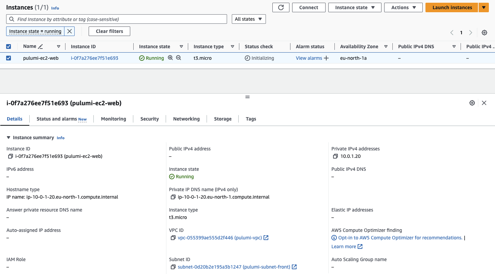

# Pulumi


## Requirements

Install Pulumi
```bash
# For MacOS
brew install pulumi/tap/pulumi

# Check it works
pulumi version
v3.115.2
```

Have a user account on [Pulumi Cloud](https://app.pulumi.com/?_gl=1*10vd1rq*_gcl_au*MTExNjMxMTI1NC4xNzE0ODg1NDY5). It's free for individual use. 

Choose a language for the project and . In this example we will use Go:
```bash
go version
go version go1.22.3 darwin/arm64
```

Export your AWS access key as environment variables:
- `AWS_ACCESS_KEY_ID`
- `AWS_SECRET_ACCESS_KEY`

## Initialization

```bash
pulumi new aws-go

This command will walk you through creating a new Pulumi project.

Enter a value or leave blank to accept the (default), and press <ENTER>.
Press ^C at any time to quit.

project name (sample):  
project description (A minimal AWS Go Pulumi program):  
Created project 'sample'

Please enter your desired stack name.
To create a stack in an organization, use the format <org-name>/<stack-name> (e.g. `acmecorp/dev`).
stack name (dev):  
Created stack 'dev'

aws:region: The AWS region to deploy into (us-east-1): eu-north-1 
Saved config

Installing dependencies...
[...]
Finished installing dependencies

Your new project is ready to go! ✨

To perform an initial deployment, run `pulumi up`
```

## Deployment

```bash
pulumi up
Previewing update (dev)

View in Browser (Ctrl+O): https://app.pulumi.com/tperelle/sample/dev/previews/288b5cea-990b-4721-ab5e-6fa002c51076

     Type                                 Name               Plan       
 +   pulumi:pulumi:Stack                  sample-dev         create     
 +   ├─ aws:ec2:SecurityGroup             ec2                create     
 +   ├─ aws:ec2:Vpc                       vpc                create     
 +   ├─ aws:ec2:Subnet                    front              create     
 +   ├─ aws:vpc:SecurityGroupEgressRule   allow_all_traffic  create     
 +   ├─ aws:ec2:Instance                  ec2                create     
 +   └─ aws:vpc:SecurityGroupIngressRule  allow_ssh          create     

Outputs:
    subnetId: output<string>
    vpcId   : output<string>

Resources:
    + 7 to create

Do you want to perform this update? yes
Updating (dev)

View in Browser (Ctrl+O): https://app.pulumi.com/tperelle/sample/dev/updates/5

     Type                                 Name               Status              
 +   pulumi:pulumi:Stack                  sample-dev         created (20s)       
 +   ├─ aws:ec2:Vpc                       vpc                created (1s)        
 +   ├─ aws:ec2:SecurityGroup             ec2                created (2s)        
 +   ├─ aws:ec2:Subnet                    front              created (1s)        
 +   ├─ aws:ec2:Instance                  ec2                created (13s)       
 +   ├─ aws:vpc:SecurityGroupIngressRule  allow_ssh          created (0.58s)     
 +   └─ aws:vpc:SecurityGroupEgressRule   allow_all_traffic  created (1s)        

Outputs:
    subnetId: "subnet-0381ea0e130e9f1c1"
    vpcId   : "vpc-09e59f57482135794"

Resources:
    + 7 created

Duration: 24s
```

The instance is provisioned in our VPC and subnet:


## Destroy

```bash
pulumi destroy
Previewing destroy (dev)

View in Browser (Ctrl+O): https://app.pulumi.com/tperelle/sample/dev/previews/d540b04d-9a01-45f5-9431-25a7e5aff1e4

     Type                                 Name               Plan       
 -   pulumi:pulumi:Stack                  sample-dev         delete     
 -   ├─ aws:vpc:SecurityGroupIngressRule  allow_ssh          delete     
 -   ├─ aws:ec2:Instance                  ec2                delete     
 -   ├─ aws:ec2:SecurityGroup             ec2                delete     
 -   ├─ aws:ec2:Subnet                    front              delete     
 -   ├─ aws:ec2:Vpc                       vpc                delete     
 -   └─ aws:vpc:SecurityGroupEgressRule   allow_all_traffic  delete     

Outputs:
  - subnetId: "subnet-0d20b2e195a3b1247"
  - vpcId   : "vpc-055399ae555d2f446"

Resources:
    - 7 to delete

Do you want to perform this destroy? yes
Destroying (dev)

View in Browser (Ctrl+O): https://app.pulumi.com/tperelle/sample/dev/updates/4

     Type                                 Name               Status              
 -   pulumi:pulumi:Stack                  sample-dev         deleted (0.48s)     
 -   ├─ aws:vpc:SecurityGroupIngressRule  allow_ssh          deleted (1s)        
 -   ├─ aws:ec2:Instance                  ec2                deleted (92s)       
 -   ├─ aws:vpc:SecurityGroupEgressRule   allow_all_traffic  deleted (1s)        
 -   ├─ aws:ec2:SecurityGroup             ec2                deleted (1s)        
 -   ├─ aws:ec2:Subnet                    front              deleted (1s)        
 -   └─ aws:ec2:Vpc                       vpc                deleted (1s)        

Outputs:
  - subnetId: "subnet-0d20b2e195a3b1247"
  - vpcId   : "vpc-055399ae555d2f446"

Resources:
    - 7 deleted

Duration: 1m40s

The resources in the stack have been deleted, but the history and configuration associated with the stack are still maintained. 
If you want to remove the stack completely, run `pulumi stack rm dev`.
```