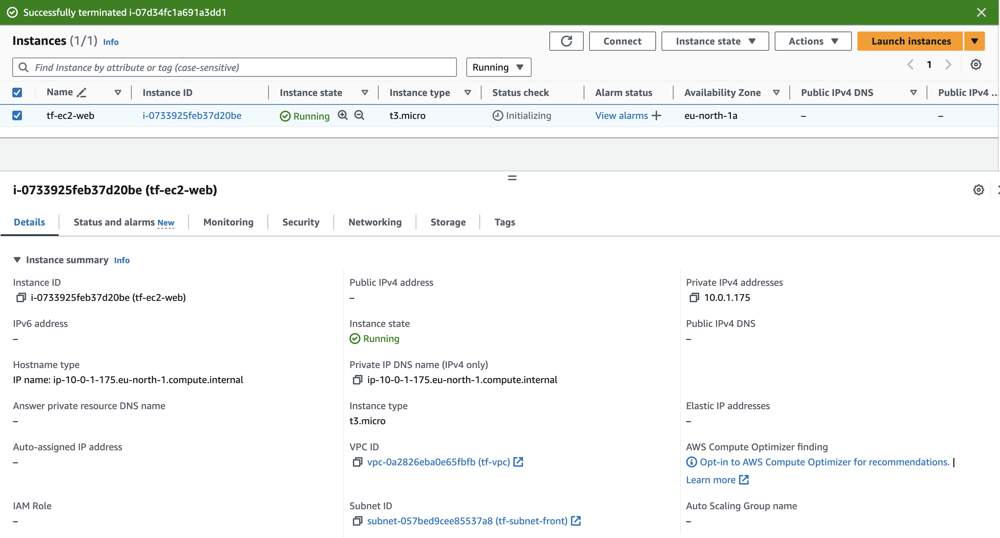

# Terraform


Documentation:
- [Official website](https://www.terraform.io/)
- [Get Started - AWS](https://developer.hashicorp.com/terraform/tutorials/aws-get-started)

## Requirements

Export your AWS access key as environment variables:
- `AWS_ACCESS_KEY_ID`
- `AWS_SECRET_ACCESS_KEY`

Create an S3 bucket to store the tfsate file.

## Initialization

```bash
terraform init

Initializing the backend...

Successfully configured the backend "s3"! Terraform will automatically
use this backend unless the backend configuration changes.

Initializing provider plugins...
- Finding hashicorp/aws versions matching "~> 5.0"...
- Installing hashicorp/aws v5.49.0...
- Installed hashicorp/aws v5.49.0 (signed by HashiCorp)

Terraform has created a lock file .terraform.lock.hcl to record the provider
selections it made above. Include this file in your version control repository
so that Terraform can guarantee to make the same selections by default when
you run "terraform init" in the future.

Terraform has been successfully initialized!

You may now begin working with Terraform. Try running "terraform plan" to see
any changes that are required for your infrastructure. All Terraform commands
should now work.

If you ever set or change modules or backend configuration for Terraform,
rerun this command to reinitialize your working directory. If you forget, other
commands will detect it and remind you to do so if necessary.
```

## Deployment

```bash
terraform plan
Terraform used the selected providers to generate the following execution plan. Resource actions are indicated with the following symbols:
  + create

Terraform will perform the following actions:

  # aws_instance.ec2 will be created
  + resource "aws_instance" "ec2" {
      + ami                                  = "ami-0705384c0b33c194c"
      + arn                                  = (known after apply)
      + associate_public_ip_address          = (known after apply)
      + availability_zone                    = (known after apply)
      + cpu_core_count                       = (known after apply)
      + cpu_threads_per_core                 = (known after apply)
      + disable_api_stop                     = (known after apply)
      + disable_api_termination              = (known after apply)
      + ebs_optimized                        = (known after apply)
      + get_password_data                    = false
      + host_id                              = (known after apply)
      + host_resource_group_arn              = (known after apply)
      + iam_instance_profile                 = (known after apply)
      + id                                   = (known after apply)
      + instance_initiated_shutdown_behavior = (known after apply)
      + instance_lifecycle                   = (known after apply)
      + instance_state                       = (known after apply)
      + instance_type                        = "t3.micro"
      + ipv6_address_count                   = (known after apply)
      + ipv6_addresses                       = (known after apply)
      + key_name                             = (known after apply)
      + monitoring                           = (known after apply)
      + outpost_arn                          = (known after apply)
      + password_data                        = (known after apply)
      + placement_group                      = (known after apply)
      + placement_partition_number           = (known after apply)
      + primary_network_interface_id         = (known after apply)
      + private_dns                          = (known after apply)
      + private_ip                           = (known after apply)
      + public_dns                           = (known after apply)
      + public_ip                            = (known after apply)
      + secondary_private_ips                = (known after apply)
      + security_groups                      = (known after apply)
      + source_dest_check                    = true
      + spot_instance_request_id             = (known after apply)
      + subnet_id                            = (known after apply)
      + tags                                 = {
          + "IaC"     = "terraform"
          + "Name"    = "tf-ec2-web"
          + "Project" = "iac-showroom"
        }
      + tags_all                             = {
          + "IaC"     = "terraform"
          + "Name"    = "tf-ec2-web"
          + "Project" = "iac-showroom"
        }
      + tenancy                              = (known after apply)
      + user_data                            = (known after apply)
      + user_data_base64                     = (known after apply)
      + user_data_replace_on_change          = false
      + vpc_security_group_ids               = (known after apply)
    }

  # aws_security_group.ec2 will be created
  + resource "aws_security_group" "ec2" {
      + arn                    = (known after apply)
      + description            = "Allows inbound access from the ALB only"
      + egress                 = [
          + {
              + cidr_blocks      = [
                  + "0.0.0.0/0",
                ]
              + from_port        = 0
              + ipv6_cidr_blocks = []
              + prefix_list_ids  = []
              + protocol         = "-1"
              + security_groups  = []
              + self             = false
              + to_port          = 0
                # (1 unchanged attribute hidden)
            },
        ]
      + id                     = (known after apply)
      + ingress                = [
          + {
              + cidr_blocks      = [
                  + "0.0.0.0/0",
                ]
              + from_port        = 22
              + ipv6_cidr_blocks = []
              + prefix_list_ids  = []
              + protocol         = "tcp"
              + security_groups  = []
              + self             = false
              + to_port          = 22
                # (1 unchanged attribute hidden)
            },
        ]
      + name                   = "ec2_security_group"
      + name_prefix            = (known after apply)
      + owner_id               = (known after apply)
      + revoke_rules_on_delete = false
      + tags_all               = (known after apply)
      + vpc_id                 = (known after apply)
    }

  # aws_subnet.front will be created
  + resource "aws_subnet" "front" {
      + arn                                            = (known after apply)
      + assign_ipv6_address_on_creation                = false
      + availability_zone                              = "eu-north-1a"
      + availability_zone_id                           = (known after apply)
      + cidr_block                                     = "10.0.1.0/24"
      + enable_dns64                                   = false
      + enable_resource_name_dns_a_record_on_launch    = false
      + enable_resource_name_dns_aaaa_record_on_launch = false
      + id                                             = (known after apply)
      + ipv6_cidr_block_association_id                 = (known after apply)
      + ipv6_native                                    = false
      + map_public_ip_on_launch                        = false
      + owner_id                                       = (known after apply)
      + private_dns_hostname_type_on_launch            = (known after apply)
      + tags                                           = {
          + "IaC"     = "terraform"
          + "Name"    = "tf-subnet-front"
          + "Project" = "iac-showroom"
        }
      + tags_all                                       = {
          + "IaC"     = "terraform"
          + "Name"    = "tf-subnet-front"
          + "Project" = "iac-showroom"
        }
      + vpc_id                                         = (known after apply)
    }

  # aws_vpc.vpc will be created
  + resource "aws_vpc" "vpc" {
      + arn                                  = (known after apply)
      + cidr_block                           = "10.0.0.0/16"
      + default_network_acl_id               = (known after apply)
      + default_route_table_id               = (known after apply)
      + default_security_group_id            = (known after apply)
      + dhcp_options_id                      = (known after apply)
      + enable_dns_hostnames                 = (known after apply)
      + enable_dns_support                   = true
      + enable_network_address_usage_metrics = (known after apply)
      + id                                   = (known after apply)
      + instance_tenancy                     = "default"
      + ipv6_association_id                  = (known after apply)
      + ipv6_cidr_block                      = (known after apply)
      + ipv6_cidr_block_network_border_group = (known after apply)
      + main_route_table_id                  = (known after apply)
      + owner_id                             = (known after apply)
      + tags                                 = {
          + "IaC"     = "terraform"
          + "Name"    = "tf-vpc"
          + "Project" = "iac-showroom"
        }
      + tags_all                             = {
          + "IaC"     = "terraform"
          + "Name"    = "tf-vpc"
          + "Project" = "iac-showroom"
        }
    }

Plan: 4 to add, 0 to change, 0 to destroy.
```

```bash
terraform apply
[...]
aws_vpc.vpc: Creating...
aws_vpc.vpc: Creation complete after 2s [id=vpc-0a2826eba0e65fbfb]
aws_subnet.front: Creating...
aws_security_group.ec2: Creating...
aws_subnet.front: Creation complete after 1s [id=subnet-057bed9cee85537a8]
aws_security_group.ec2: Creation complete after 3s [id=sg-0a0073a78a69e709e]
aws_instance.ec2: Creating...
aws_instance.ec2: Still creating... [10s elapsed]
aws_instance.ec2: Creation complete after 13s [id=i-0733925feb37d20be]

Apply complete! Resources: 4 added, 0 changed, 0 destroyed.
```

The instance is provisioned in our VPC and subnet:


## Destroy

```bash
terraform destroy
aws_instance.ec2: Destroying... [id=i-08c2dbb3097253982]
aws_instance.ec2: Still destroying... [id=i-08c2dbb3097253982, 10s elapsed]
aws_instance.ec2: Still destroying... [id=i-08c2dbb3097253982, 20s elapsed]
aws_instance.ec2: Still destroying... [id=i-08c2dbb3097253982, 30s elapsed]
aws_instance.ec2: Still destroying... [id=i-08c2dbb3097253982, 40s elapsed]
aws_instance.ec2: Still destroying... [id=i-08c2dbb3097253982, 50s elapsed]
aws_instance.ec2: Still destroying... [id=i-08c2dbb3097253982, 1m0s elapsed]
aws_instance.ec2: Still destroying... [id=i-08c2dbb3097253982, 1m10s elapsed]
aws_instance.ec2: Still destroying... [id=i-08c2dbb3097253982, 1m20s elapsed]
aws_instance.ec2: Still destroying... [id=i-08c2dbb3097253982, 1m30s elapsed]
aws_instance.ec2: Still destroying... [id=i-08c2dbb3097253982, 1m40s elapsed]
aws_instance.ec2: Still destroying... [id=i-08c2dbb3097253982, 1m50s elapsed]
aws_instance.ec2: Still destroying... [id=i-08c2dbb3097253982, 2m0s elapsed]
aws_instance.ec2: Still destroying... [id=i-08c2dbb3097253982, 2m10s elapsed]
aws_instance.ec2: Destruction complete after 2m12s
aws_subnet.front: Destroying... [id=subnet-0453316fb14e8a44f]
aws_security_group.ec2: Destroying... [id=sg-0974b238d5abed6c9]
aws_subnet.front: Destruction complete after 1s
aws_security_group.ec2: Destruction complete after 1s
aws_vpc.vpc: Destroying... [id=vpc-084ea965deae0f93d]
aws_vpc.vpc: Destruction complete after 1s

Destroy complete! Resources: 4 destroyed.
```